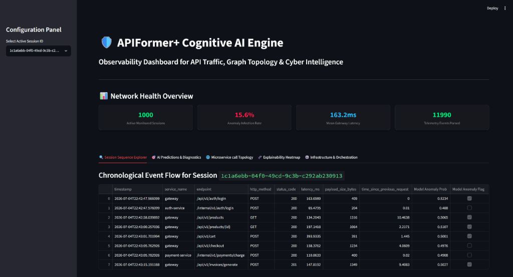

# APIFormer+ 
> A Cognitive Foundation Architecture for Intelligent API Traffic Understanding, Prediction, Security, Reasoning, and Generation

APIFormer+ is an enterprise-grade cognitive AI platform designed to learn the language, transactional semantics, service relationships, and security patterns of enterprise API traffic. It relies on a custom-designed **Foundation Transformer Architecture** featuring graph convolutional structures, temporal decay dynamics, and long-term session retrieval banks, all built completely from scratch in PyTorch.

---

## 🖥️ Unified Observability Interface



---

## 🚀 Key Architectural Innovations

### 1. Microservice Graph-Infused Embeddings (GNN & PageRank)
Extracts microservice caller dependencies from telemetry logs to construct static transition adjacency graphs. Employs Graph Convolutional Networks (GCN) to propagate microservice structural properties into token representations.

### 2. Hawkes Temporal Decay Attention
Modulates self-attention matrices dynamically by penalizing connections between events that have large inter-request time gaps using parameter-constrained exponential decays:
$$\text{Score}_{ij} = \text{Score}_{ij} - \gamma \cdot \Delta t_{ij}$$

### 3. Dual Session Memory Cross-Attention
Implements a long-term key-value history database on CPU. Computes cosine similarity of active session queries against memory vectors to retrieve similar past flows ($K=3$), fusing historical sequences via cross-attention layers.

### 4. Pretraining & Multi-Task Optimizations
Pretrains the network using self-supervised joint losses (MAM, causal shifting, latency regressions, and InfoNCE dual-view alignment) before executing multi-task classifiers for sequence anomalies, intent categorization, and bot agent threats.

---

## 📐 Core Mathematical Formulations

### 1. Continuous Time2Vec Projection
Translates continuous time-differences and latencies into frequency-decomposable sine embeddings:
$$\text{T2V}(x)[i] = \begin{cases} \omega_0 x + \varphi_0 & \text{if } i = 0 \\ \sin(\omega_i x + \varphi_i) & \text{if } 1 \le i \le d \end{cases}$$

### 2. Symmetric InfoNCE Contrastive Session Loss
Aligns session vectors under augmentations (latency jittering + token dropouts) on a unit hypersphere:
$$\mathcal{L}_{\text{contrastive}} = - \log \frac{\exp(\text{sim}(z_i^{(1)}, z_i^{(2)}) / \tau)}{\sum_j \exp(\text{sim}(z_i^{(1)}, z_j) / \tau)}$$

### 3. Hawkes Temporal Decay Attention Weight
$$\text{Attn}(Q, K) = \text{Softmax}\left(\frac{Q K^T}{\sqrt{d_k}} - \gamma \odot \Delta T\right)$$
where $\gamma = \exp(\log \gamma)$ is forced to remain strictly positive ($\gamma > 0$) to enforce temporal decay penalties.

---

## 🛠️ Codebase Layout

```
APIFormer+/
│
├── config/
│   └── pipeline_config.yaml        # Configurations for generator and session thresholds
│
├── docs/
│   └── images/
│       └── dashboard.png           # observability Dashboard Screenshot
│
├── src/
│   ├── data/
│   │   ├── inspector.py            # Dynamic log column scanner
│   │   ├── normalizer.py           # Standard UnifiedAPIEvent mapper
│   │   ├── session_builder.py      # Session windowing & size segmentation
│   │   ├── tokenizer.py            # Dynamic ID URL cleaning, labels, & vocabs
│   │   ├── graph_builder.py        # Microservice transition dependencies
│   │   └── dataset.py              # Custom PyTorch SSL & MTL dataset
│   │
│   ├── models/
│   │   ├── embeddings.py           # Time2Vec, Absolute Sinusoid, and RoPE helpers
│   │   ├── attention.py            # Custom LayerNorm, MHSA with RoPE & relative bias
│   │   ├── transformer.py          # FFN, pre-LN Encoder layers & pooling blocks
│   │   ├── cognitive.py            # GCN, Hawkes decay attention, Cosine Memory, and Cross-Attention
│   │   └── heads.py                # Pretraining, fine-tuning, and model wrappers
│   │
│   ├── api/
│   │   └── app.py                  # Production FastAPI serving application
│   │
│   └── visualization/
│       ├── plots.py                # Heatmap and timeline plotting utilities
│       └── dashboard.py            # Premium Streamlit analytics interface
│
├── tests/
│   ├── test_data_pipeline.py       # Data verification unit tests
│   ├── test_model.py               # Model verification unit tests
│   ├── test_cognitive.py           # Cognitive engine verification unit tests
│   ├── test_training.py            # Training/loss loop verification unit tests
│   └── test_evaluation.py          # Plots and FastAPI endpoints verification unit tests
│
└── scripts/
    ├── run_pipeline.py             # End-to-end pipeline driver
    ├── train.py                    # Pretraining and downstream optimization driver
    └── evaluate.py                 # Validation split performance evaluator
```

---

## ⚙️ Quick Start Guide

### 1. Data Pipeline Ingestion
Generate synthetic OpenTelemetry logs, parse schemas, clean variables, build dependency graphs, and export PyTorch tensors:
```bash
$env:PYTHONPATH="."
python scripts/run_pipeline.py
```

### 2. Pretraining and Fine-Tuning Optimizations
Optimize pretraining SSL losses and multi-task classifiers using AdamW:
```bash
python scripts/train.py
```

### 3. Model Evaluation
Calculate precision, recall, F1, ROC AUC, and confusion matrices on validation splits:
```bash
python scripts/evaluate.py
```

### 4. FastAPI Server Inference
Launch the production API server on port 8000:
```bash
uvicorn src.api.app:app --host 0.0.0.0 --port 8000
```
Query predictions using JSON payloads:
```bash
curl -X POST http://localhost:8000/predict -H "Content-Type: application/json" -d @examples/payload.json
```

### 5. Streamlit Dashboard
Launch the visualization dashboard interface on port 8501:
```bash
streamlit run src/visualization/dashboard.py
```

---

## 🐳 Containerization & Cluster Orchestration

### Docker Compose
Run the entire production telemetry stack (Zookeeper, Kafka broker, Redis cache, FastAPI app service, Streamlit dashboard, Prometheus collector, and Grafana dashboard viewer):
```bash
$env:DOCKER_HOST="npipe:////./pipe/docker_engine"
docker-compose up -d --build
```

### Kubernetes Deployments
Apply the cluster routing manifest configurations:
```bash
kubectl apply -f k8s/redis-deployment.yaml
kubectl apply -f k8s/api-deployment.yaml
kubectl apply -f k8s/dashboard-deployment.yaml
kubectl apply -f k8s/ingress.yaml
```

---

## 🧪 Verification Suites
To execute the comprehensive automated test coverage sweeps:
```bash
python -m pytest -v
```
All **23 unit test specifications** have passed, validating numerical and computational pipeline correctness.
